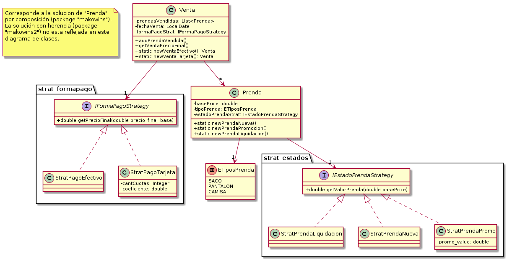

# DDS 2020
## Makowins
Autor: Emilio Guernik  
Curso: Diseño de sistemas 2020, K3053

[Enunciado original](https://docs.google.com/document/d/1mjWKl9YH9Bb39iIUl1bQj_xhx_-CjCAMpcAXRqKhVjU/edit#)

## Requerimientos:
> Conocer el tipo y precio de venta de una prenda

> Conocer las ganancias de un determinado día a partir de las ventas registradas

## Diagrama de clases

## Comentarios y consideraciones

### Sobre el tipo de dato para representar el valor monetario
 [Mucha](https://dzone.com/articles/never-use-float-and-double-for-monetary-calculatio) [literatura](https://lemnik.wordpress.com/2011/03/25/bigdecimal-and-your-money/) [hay](https://www.javaworld.com/article/2075315/make-cents-with-bigdecimal.html) [sobre](http://java-performance.info/bigdecimal-vs-double-in-financial-calculations/) qué tipo/estructura/[library](https://www.joda.org/joda-money/) usar al momento de modelar dinero.  
 Para esta solución, se considera suficientemente el uso de _double_.

### Sobre el tipo de dato para representar el valor monetario
La duda fue cómo representar el estado de la prenda. Al hacerlo como strategy, gano flexibilidad (¿Composition over inheritance?), pero esto abre la nueva pregunta de _donde configurar el strategy_, ya que no quiero agregarle una responsabilidad al usuario de la clase _prenda_. Mi solución fue agregar 3 m estáticos al estilo _factory_ a la clase _Prenda_: _newPrendaNueva()_, _newPrendaPromocion()_ y _newPrendaLiquidacion()_. Cada método devuelve un objeto prenda configurado.
Esta es la solución implementada en el package _makowins_.
Además, en el package _makowins2_ está implementada la solucíon con herencia, de modo de poder constrastarlas.

